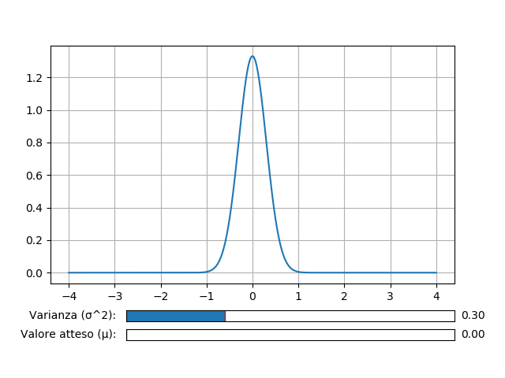
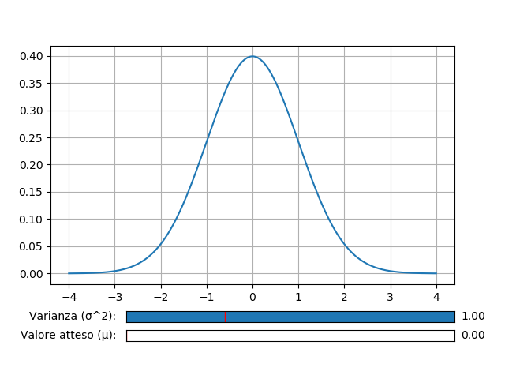
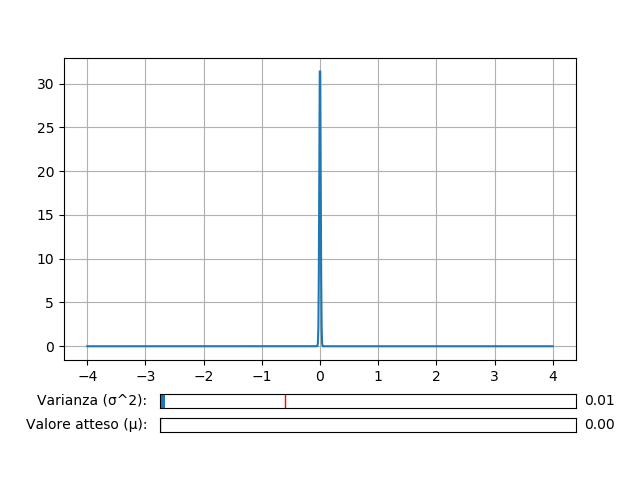
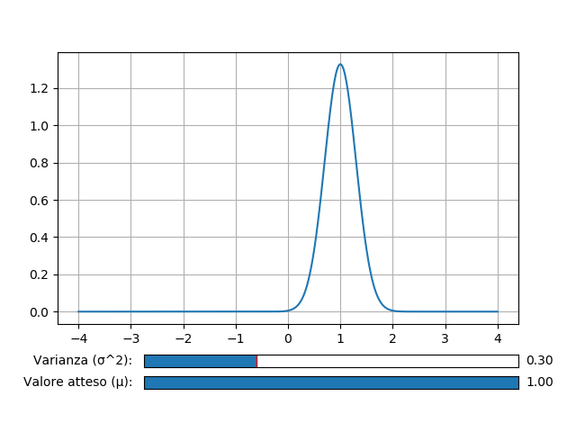

# Distribuzione Normale di Carl Friedrich Gauss

Nella teoria della probabilità la distribuzione normale, o di Gauss (o gaussiana) dal nome del matematico tedesco Carl Friedrich Gauss, è una distribuzione di probabilità continua che è spesso usata come prima approssimazione per descrivere variabili casuali a valori reali che tendono a concentrarsi attorno a un singolo valor medio. Il grafico della funzione di densità di probabilità associata è simmetrico e ha una forma a campana, nota come campana di Gauss (o anche come curva degli errori, curva a campana, ogiva).

La distribuzione normale dipende da due parametri, la media μ e la varianza σ^2, ed è indicata tradizionalmente con:

La distribuzione normale è caratterizzata dalla seguente funzione di densità di probabilità:

Dove μ è il valore atteso e σ^2 la varianza.

La rappresentazione grafica della distribuzione normale è la seguente:

Se modifico il valore della varianza σ^2 facendolo crescere, si nota come diminuisce il picco massimo e come aumenta l'area sottesa alla curva di Gauss:

Mentre se diminuisco di molto il valore della varianza σ^2, quindi prossimo allo zero, si nota come aumenta il picco massimo e come dimiuscire l'area sottesa alla curva di Gauss:

Finora il valore atteso μ è rimasto fisso a zero però, se si aumenta il suo valore, si nota come la curva di Gauss trasla verso destra:

# Per maggiori informazioni

Spiegazione online Distribuzione Normale di Gauss con Python: https://www.youtube.com/watch?v=2_sL1sfnRvk&t=239s

Distribuzione Normale [Teoria] : https://it.wikipedia.org/wiki/Distribuzione_normale

Created By Antonio Bernardini Copyright© 2020
